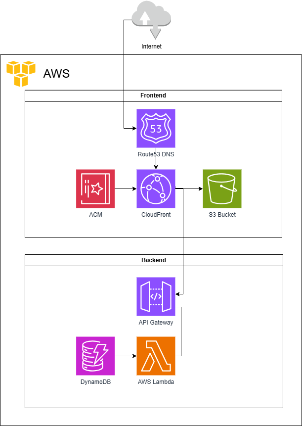

# Resume

My online resume to practice AWS and complete the Cloud Resume Challenge.

This project is basically my resume with some personal information redacted, hosted on AWS with the simple feature of counting and displaying the amount of visits to the website. 

## Architecture:

### Frontend

Simple website written with html and tailwind, hosted on a private S3 Bucket, served through CloudFront and Route53 on [urielc.com](urielc.com) and encrypted on https with a certificate from ACM

### Backend

Simple python Lambda that uses DynamoDB to keep track and update the visitor count, accessed by an Api Gateway through CloudFront on a post request to [urielc.com/api/visitors](urielc.com/api/visitors)

### Visualization

1. Setting up the IAM role:
In order to be able to use terraform to deploy and destroy my infra, I want to use github actions. To do so I must enable OIDC connection from github, such that aws allows github actions to assume my role and thus have access to AWS resources. 
I followed [this guide from aws](https://docs.aws.amazon.com/IAM/latest/UserGuide/id_roles_create_for-idp_oidc.html#idp_oidc_Create_GitHub) to create that role and identity provider and [this guide from github](https://docs.github.com/en/actions/security-for-github-actions/security-hardening-your-deployments/configuring-openid-connect-in-amazon-web-services)

2. Setting up first terraform and github actions
First I had to manually create the s3 bucket that will house my terraform state.
Then I created the terraform module to setup the backend to s3, along with creating the bucket for the resume html file and uploading it to it.
Then create the deploy pipeline in github actions to apply the terraform.

3. I then went on to first create the resume.html file, and then create the necessary s3 bucket for it and the cloudfront distribution to access it, since we don't want to access the bucket directly from the public.
After that worked I went on to buy the DNS I wanted in route53 and create the necessary record to access it.

4. Now all that was left was to create the python code for the lambda and write the terraform for the lambda, dynamodb that the lambda uses and the apigateway to allow access to this lambda on a post request.
Once that worked all that was left was to change the existing cloudfront code to allow another origin on a specific url endpoint "/api".
I also made sure that the deploy action listened for changes on the backend as well.

5. To wrap things I added the simple javascript functionality on the frontend to access the api to retrieve the visitor count and change the cors settings on the lambda. Then finally everything worked together.